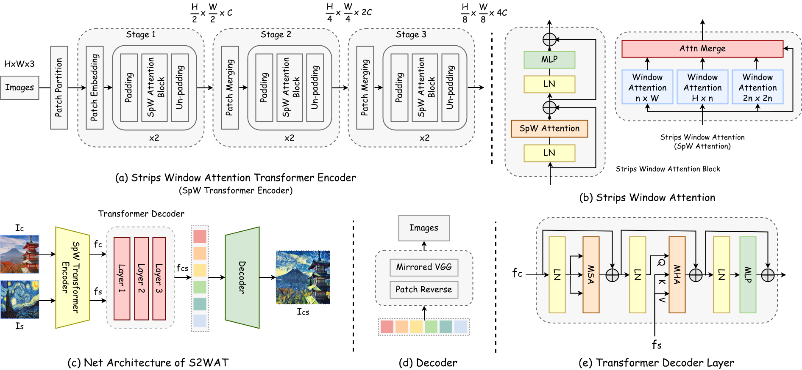

# S2WAT (AAAI 2024)

<center class='half'>
    
</center>


Official [PyTorch](https://pytorch.org) implementation of the paper:

[**S2WAT: Image Style Transfer via Hierarchical Vision Transformer using Strips Window Attention**](https://arxiv.org/abs/2210.12381)  

[Chiyu Zhang](https://alienzhang1996.github.io/), Xiaogang Xu*, [Lei Wang](https://orcid.org/0000-0002-6301-0949), [Zaiyan Dai](https://orcid.org/0000-0003-0838-6318),  [Jun Yang\*](https://dblp.org/pid/181/2799-25.html)


S2WAT is a universal style transfer method consisting of three parts: a) an encoder based on a hierarchical vision Transformer, b) a transfer module based on a Transformer decoder, and c) a decoder based on a mirrored VGG. Introducing window-based hierarchical vision Transformers, such as Swin Transformer, to image style transfer directly will result in *locality problem*. S2WAT overcomes this problem with Strips Window Attention (SpW Attention) and is capable of  alleviating the *content leak* issue.


## Architecture

<center class='half'>
    
</center>


## Style Transfer Examples

<center class='half'>
    
</center>

<center class='half'>
    
</center>


## Results under Content Leak

<center class='half'>
    
</center>


## Dependencies

- Python = 3.8.13
- PyTorch = 1.10.0
- CUDA = 11.3
- cuDNN = 8.2.0

Optionally, if you are a `conda` user, you can execute the following command in the root directory of this repository to create a new environment with all dependencies installed.

```python
conda env create -f environment.yaml
```


## Pretrained Models & Datasets

### Pretrained Models

If you want to use the pre-trained model to perform style transfer or train a new model taking the pre-trained parameters as the initial, please download the pre-trained files from Google Drive as follows:

- <a id="VGG19" href="https://drive.google.com/file/d/1nJt6nnEIjBfQMzbH9__TrLJfmHqkaHjy/view?usp=share_link">VGG19</a>
- <a id="Pre-trained" href="https://drive.google.com/file/d/16Ihs_J9ULYSze2lL5cmptvMyy-ZYJ9kN/view?usp=share_link">Pre-trained model</a>

Put VGG19 to the ```pre_trained_models``` directory and the pre-trained model to the ```pre_trained_models/checkpoint``` directory under the root of this repository. Then execute the following commands ([Training ](#Training) or [Testing](#Testing)) in the root of the repository.


### Datasets

The datasets of content images and style images are as follows:

|                  Content Dataset                  |                     Style Dataset                      |
| :-----------------------------------------------: | :----------------------------------------------------: |
| [MS_COCO 2014](https://cocodataset.org/#download) | [WikiArt](https://www.kaggle.com/c/painter-by-numbers) |

We select 80000 pictures from COCO and WikiArt respectively to build content and style datasets. Then preprocess the content and style datasets before training with ```data_preprocess.py``` in which images are resized to 512 on the shorter side and then randomly cropped to 224 x 224. You can use the [preprocessed version](https://www.kaggle.com/datasets/alienzhang/styletransfer224) of the datasets directly or execute the following commands to build one.

```python
python3 data_preprocess.py --source_dir ./source --target_dir ./target
```

- ```source_dir```: Directory to the images to be processed
  - ```source_dir``` needs a subfolder of any name to load images, such as ```./source/images```
- ```target_dir```: Directory to save the processed images


## Training<a id="Training"> </a>

To train S2WAT by yourself, you can run the following commands. Before running the commands, please make sure:

- the pre-trained [VGG19](#VGG19), *vgg_normalised.pth*, should be placed to ```vgg_dir```.
- the [pre-trained model](#Pre-trained), *checkpoint_40000_epoch.pkl* as default, should be placed to ```checkpoint_import_path```, if you want to train a model taking a checkpoint as the initial parameter.

```python
# Train from scratch
python3 train.py --content_dir ./input/Train/Content --style_dir ./input/Train/Style --vgg_dir ./pre_trained_models/vgg_normalised.pth --epoch 40000 --checkpoint_save_interval 10000 --loss_count_interval 400

# Train from a checkpoint
python3 train.py --content_dir ./input/Train/Content --style_dir ./input/Train/Style --vgg_dir ./pre_trained_models/vgg_normalised.pth --epoch 40000 --checkpoint_save_interval 10000 --loss_count_interval 400 --resume_train True --checkpoint_import_path ./pre_trained_models/checkpoint/checkpoint_40000_epoch.pkl
```

- ```content_dir```: Directory path to a batch of content images
- ```style_dir```: Directory path to a batch of style images
- ```vgg_dir```: Directory path to the pre-trained VGG19
- ```epoch```: The number of iterations of the training has
- ```checkpoint_save_interval```: Directory path to save a checkpoint
- ```loss_count_interval```: The interval to calculate average losses
- ```resume_train```: Whether or not to train with a checkpoint as the initial parameters
- ```checkpoint_import_path```: Directory path to the importing checkpoint


## Testing<a id="Testing"> </a>

To test the style transfer performance of the pre-trained model. Before running the following command, please make sure:

- the [pre-trained model](#Pre-trained), *checkpoint_40000_epoch.pkl*, are placed to the ```checkpoint_import_path```.
- the ```input_dir``` contains two subfolders, *Content* and *Style*, and each subfolder has loaded images.

```python
python3 test.py --input_dir ./input/Test --output_dir ./output --checkpoint_import_path ./pre_trained_models/checkpoint/checkpoint_40000_epoch.pkl
```

- ```input_dir```: Directory path to a batch of content and style images which are loaded in *Content* / *Style* subfolders respectively
- ```output_dir```: Directory to save the output images
- ```checkpoint_import_path```: Directory path to the importing checkpoint


## Contact

If you have any questions, please contact alienzhang19961005@gmail.com.
